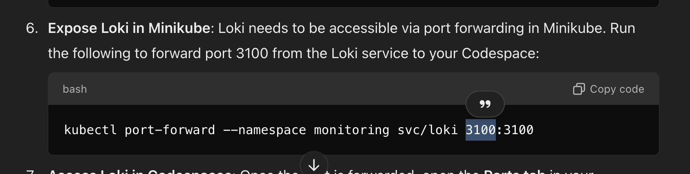

# Images

## 🐱 Loki GitOver CodeSpaces

## 🌐 Port visibility

## 🔄 Port forwarding

## 📝 Loki written with Go

## 🎧 Loki listen port

## 📊 Loki Grafana component

## 🖧 Docker network

## 🔄 Docker restart

## 🔄 Pivot to Minikube from Docker

## 🚗 Minikube autodriver Loki

## 🔄 Leftside your port, rightside container port

