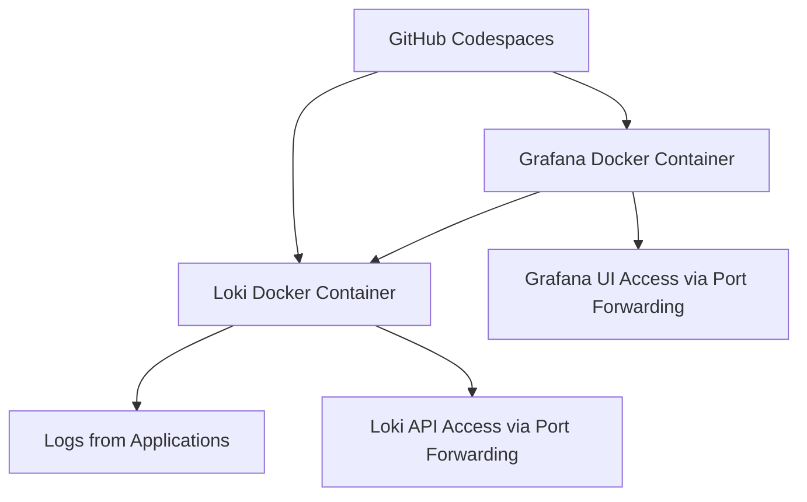

Here is a description of the architecture and a corresponding diagram for the Loki-Grafana relationship running in GitHub Codespaces with code forwarding.

### Loki-Grafana Architecture in GitHub Codespaces

1. **GitHub Codespaces**:
   - Codespaces is a cloud-based development environment.
   - It allows you to run Loki (log aggregation tool) and Grafana (data visualization tool) in a Docker container.
   - This environment is connected to VSCode through **code forwarding**, which lets developers access Grafana and Loki services from their local browser.

2. **Loki**:
   - Loki is deployed as a log aggregation tool inside a Docker container.
   - It ingests logs from various sources like applications or Kubernetes clusters and stores them efficiently.
   - Loki is queried via its API by Grafana to display logs.

3. **Grafana**:
   - Grafana is also deployed in a Docker container inside Codespaces.
   - It connects to Loki using a **data source** configuration to visualize logs.
   - Grafana queries the Loki API to retrieve and present log data in dashboards.

4. **Code Forwarding**:
   - GitHub Codespaces provides a feature for **port forwarding**, which allows you to expose the Grafana dashboard and Loki's API to your local machine or external users for visualization and API access.

### Diagram

The architecture can be represented as follows:



- **GitHub Codespaces** runs both Loki and Grafana in Docker containers.
- **Grafana** queries **Loki** for logs and displays them in a dashboard.
- Logs come from various applications, and **port forwarding** exposes the Grafana dashboard and Loki's API to the external world.

### README (Markdown)

```markdown
# Loki-Grafana Setup in GitHub Codespaces with Port Forwarding

## Architecture Overview

This project sets up a log aggregation and visualization system using Loki and Grafana inside a GitHub Codespaces environment. The services are run as Docker containers and exposed using GitHub Codespaces' port forwarding.

### Components

1. **GitHub Codespaces**:
   - Provides a cloud-based development environment to run Loki and Grafana.
   - Exposes Grafana UI and Loki API via port forwarding.

2. **Loki**:
   - Loki is used to collect and query logs.
   - It is deployed as a Docker container.
   - Loki stores log data and exposes an API for Grafana to query logs.

3. **Grafana**:
   - Grafana is used to visualize the logs collected by Loki.
   - It connects to Loki as a data source.
   - Grafana is also deployed in a Docker container.

4. **Code Forwarding**:
   - GitHub Codespaces allows port forwarding for external access to the Grafana dashboard and Loki API.

## Setup Steps

1. **Clone the repository**:
   ```bash
   git clone https://github.com/your-repo/loki-grafana-codespaces.git
   ```

2. **Open in GitHub Codespaces**:
   - Open the repository in GitHub Codespaces to start the environment.

3. **Run Docker Containers**:
   - Run the Docker Compose setup that includes Loki and Grafana.
   ```bash
   docker-compose up
   ```

4. **Configure Port Forwarding**:
   - Forward the necessary ports in GitHub Codespaces for external access to Grafana and Loki.
   - Example:
     - Grafana: Port 3000
     - Loki API: Port 3100

5. **Access Grafana**:
   - Open the forwarded URL in your local browser to access Grafana.

6. **Add Loki as a Data Source**:
   - In the Grafana UI, add Loki as a data source by pointing to the forwarded Loki API port (e.g., `http://localhost:3100`).

## Diagram


## Useful Links

- [Loki Documentation](https://grafana.com/docs/loki/latest/)
- [Grafana Documentation](https://grafana.com/docs/grafana/latest/)

```

This diagram and README file will give a clear understanding of the Loki-Grafana setup in GitHub Codespaces with port forwarding.